# TrailNest — Full Project Documentation

> A plain-language, diagram-heavy walkthrough of the entire TrailNest project: what it is,
> how the code is organized, how the three services talk to each other, and how Docker ties
> it all together. Written so you can read it top to bottom and come away actually
> understanding the project, not just able to run it.
>
> 📸 **Image placeholders** are dropped throughout, marked like the box below. Drag your own
> screenshots into a `docs/images/` folder and swap the placeholder line for a real
> `` link whenever you're ready — nothing here depends on the
> images existing yet.

```
🖼️ PLACEHOLDER — description of what to capture
   
```

---

## Table of contents

1. [What is TrailNest?](#1-what-is-trailnest)
2. [Tech stack at a glance](#2-tech-stack-at-a-glance)
3. [Repository tour](#3-repository-tour)
4. [The big picture — how everything fits together](#4-the-big-picture-how-everything-fits-together)
5. [The database layer](#5-the-database-layer)
6. [The backend (Express API)](#6-the-backend-express-api)
7. [Authentication & session flow, end to end](#7-authentication-session-flow-end-to-end)
8. [The frontend (Next.js App Router)](#8-the-frontend-nextjs-app-router)
9. [Docker & containerization](#9-docker-containerization)
10. [Environment variables reference](#10-environment-variables-reference)
11. [Running TrailNest](#11-running-trailnest)
12. [Screenshots & visuals](#12-screenshots-visuals)
13. [Glossary — plain-language terms](#13-glossary-plain-language-terms)
14. [What's next](#14-whats-next)

---

## 1. What is TrailNest?

TrailNest is a small, self-contained **travel/property-listings app**, deliberately built at
compressed scope, whose real purpose is to be a **DevOps capstone reference project** — a
realistic-but-small stack you can containerize, deploy, and reason about without touching
anything belonging to a real business.

It mirrors a real production shape:

- A public-facing site where visitors browse property listings and send inquiries.
- A private owner dashboard where property owners log in, list stays, and manage the leads
  (inquiries) that come in.

Three deliberate **non-goals** keep the scope small enough to fully understand in one sitting:
no payments, no booking calendar, no reviews, no multi-role complexity (only one role,
`owner`, exists).

```
🖼️ PLACEHOLDER — full-page screenshot of the home page (listings grid)
   
```

---

## 2. Tech stack at a glance

| Layer          | Choice                                   | Why it's here                                                        |
|----------------|-------------------------------------------|-----------------------------------------------------------------------|
| Frontend       | Next.js 16 (App Router) + React 19        | Server-rendered pages, file-based routing, mixes server & client code |
| Backend        | Node.js + Express 4                       | A small, unopinionated REST API                                       |
| Database       | MySQL 8.0                                 | Relational data: owners → properties → leads                          |
| DB access      | `mysql2/promise` (raw SQL, **no ORM**)    | Keeps the SQL visible and simple — nothing to learn beyond SQL itself |
| Auth           | JWT (`jsonwebtoken`) + `bcryptjs`         | Stateless tokens; passwords are hashed, never stored in plain text    |
| Containers     | Docker, multi-stage builds                | Each service ships as a small, reproducible image                     |
| Orchestration  | Docker Compose                            | Runs all three containers together on one shared network              |
| Deploy target  | AWS EC2 (Ubuntu) — **not yet built**      | The next phase after Compose is verified locally                      |

---

## 3. Repository tour

```
trailnest/
├── frontend/               Next.js app (what the browser talks to)
│   ├── app/                 App Router pages (file-based routing)
│   ├── components/          Reusable UI pieces (buttons, cards, forms...)
│   ├── lib/                 Small helper modules (api client, auth/session)
│   ├── styles/               Global CSS tokens
│   ├── Dockerfile
│   └── .env.local            Local-dev-only env vars (gitignored)
│
├── backend/                 Express REST API
│   ├── src/
│   │   ├── controllers/      One file per resource — the actual logic
│   │   ├── routes/           Maps URLs → controller functions
│   │   ├── middleware/       Cross-cutting concerns (auth check, error handling)
│   │   ├── config/db.js       The MySQL connection pool
│   │   ├── app.js             Builds the Express app (middleware + routes wired up)
│   │   └── server.js          Actually starts listening on a port
│   ├── Dockerfile
│   └── .env                  Local-dev-only env vars (gitignored)
│
├── db/
│   ├── schema.sql            CREATE TABLE statements
│   └── seed.sql               Fictional demo data (owner, properties, leads)
│
├── docs/
│   ├── DOCKER_GUIDE.md        A line-by-line walkthrough of the Docker setup (already
│   │                           in this repo — this document builds on top of it)
│   └── PROJECT_DOCUMENTATION.md   ← you are here
│
├── docker-compose.yml        Wires the three containers together
├── .env                      Docker Compose secrets (gitignored)
└── README.md                 Quick-start instructions
```

**Why `frontend/` and `backend/` are fully separate projects (not an npm-workspaces
monorepo):** each one becomes its own Docker image with its own `package.json`, own
`node_modules`, and own build lifecycle. A Dockerfile only ever needs to `COPY` its own
directory — nothing shared to reason about, and a change in one service can't invalidate the
other's build cache.

---

## 4. The big picture — how everything fits together

Three containers, one shared Docker network, two different "audiences" hitting the frontend
(a browser, and Docker's internal DNS):

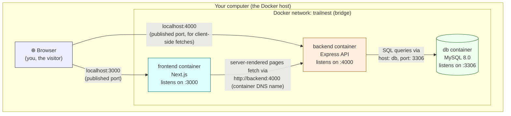

Two rules make this diagram click into place, and they matter for *every* Docker Compose
project you'll ever build, not just this one:

1. **Inside** the `trailnest` network, containers reach each other **by service name** —
   `backend` can connect to `db:3306` the same way your laptop resolves `localhost`. Docker
   runs a tiny internal DNS server that does this automatically.
2. **Outside** the network (your browser, a `curl` from your terminal), only ports explicitly
   *published* in `docker-compose.yml` (`ports: ["4000:4000"]`) are reachable, and only via
   `localhost:<published-port>`. The `db` service publishes **no** port on purpose — nothing
   outside the network should ever talk to MySQL directly.

```
🖼️ PLACEHOLDER — `docker compose ps` output showing all three containers "healthy"
   
```

---

## 5. The database layer

Three tables, a simple parent → child → grandchild chain:

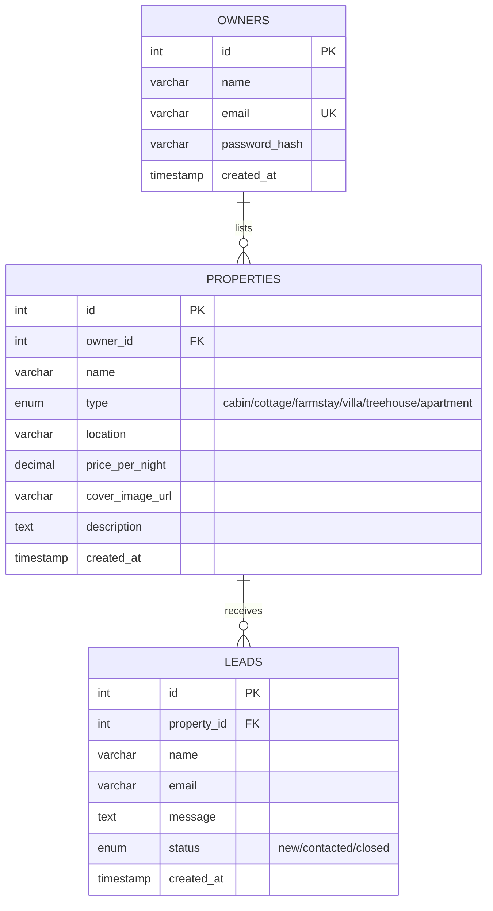

- `owners.email` is `UNIQUE` — one account per email address.
- `properties.owner_id → owners.id` is `ON DELETE CASCADE` — delete an owner, their listings
  go with them.
- `leads.property_id → properties.id` is also `ON DELETE CASCADE` — delete a listing, its
  inquiries go with it.
- Passwords are **never** stored as-is — only `password_hash`, produced by `bcryptjs` (see
  [§7](#7-authentication--session-flow-end-to-end)).
- `db/schema.sql` and `db/seed.sql` aren't run manually against Docker — the official
  `mysql:8.0` image automatically executes every `.sql`/`.sh` file it finds mounted into
  `/docker-entrypoint-initdb.d/`, in filename order, **the first time** the data directory is
  empty. That's why the files are Compose-mounted as `01-schema.sql` and `02-seed.sql` — schema
  has to exist before seed data can reference it.

```
🖼️ PLACEHOLDER — a database GUI tool (e.g. TablePlus, MySQL Workbench) showing the three
   tables and their rows, connected via the `3307:3306` local mapping described in §11
   
```

---

## 6. The backend (Express API)

### 6.1 App structure

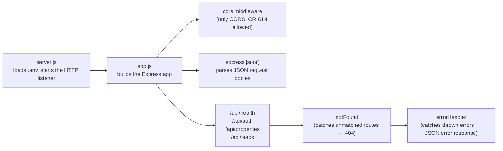

Splitting `server.js` (starts listening) from `app.js` (builds the Express app) is a common
Node pattern: it lets you `require('./app')` in a test file and exercise routes without
actually binding a port.

### 6.2 Routes reference

| Method | Path                          | Auth required? | Controller                          | What it does                                    |
|--------|-------------------------------|-----------------|---------------------------------------|--------------------------------------------------|
| GET    | `/api/health`                 | No              | inline in `health.routes.js`         | Pings the DB, reports `{status, db}`             |
| POST   | `/api/auth/register`          | No              | `auth.controller.register`           | Creates an owner account, returns a JWT          |
| POST   | `/api/auth/login`              | No              | `auth.controller.login`              | Verifies credentials, returns a JWT              |
| GET    | `/api/auth/me`                 | **Yes**          | `auth.controller.me`                 | Returns the logged-in owner's profile            |
| GET    | `/api/properties`               | No              | `properties.controller.list`         | All properties (the public listings grid)        |
| GET    | `/api/properties/mine`          | **Yes**          | `properties.controller.listMine`     | Only the logged-in owner's properties            |
| GET    | `/api/properties/:id`           | No              | `properties.controller.getById`      | One property's detail                            |
| POST   | `/api/properties`               | **Yes**          | `properties.controller.create`       | Creates a new listing, owned by the caller       |
| POST   | `/api/properties/:propertyId/leads` | No           | `leads.controller.create`            | A visitor sends an inquiry about a property       |
| GET    | `/api/leads`                     | **Yes**          | `leads.controller.listForOwner`      | All inquiries across the owner's properties       |
| PATCH  | `/api/leads/:id`                 | **Yes**          | `leads.controller.updateStatus`      | Moves a lead between `new` / `contacted` / `closed` |

Note the asymmetry: **listing** properties and **sending** a lead are public (anyone browsing
the site can do them, no login) — **managing** properties/leads requires being logged in as
the owner who created them. `leads.controller.listForOwner` and `updateStatus` both `JOIN`
back through `properties` and filter `WHERE p.owner_id = ?`, so one owner can never see or
edit another owner's leads even with a valid token.

### 6.3 The auth guard (middleware)

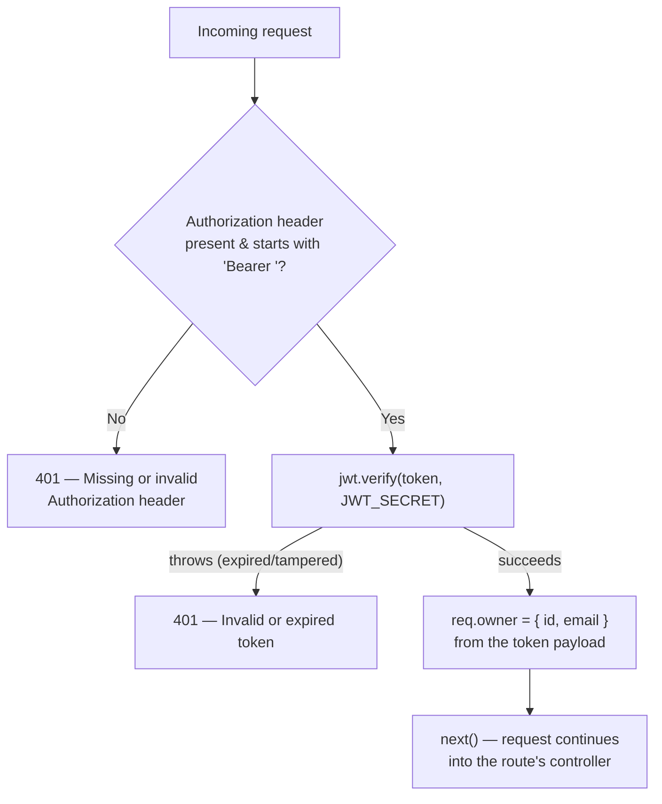

`requireAuth` (`backend/src/middleware/auth.js`) is what makes every "Yes" row in the table
above possible — it's inserted directly into the route definition, e.g.
`router.get('/mine', requireAuth, listMine)`. If it doesn't call `next()`, the controller never
runs.

### 6.4 Error handling

Two middlewares sit at the very end of `app.js`, after every route:

- `notFound` — anything that didn't match a route above falls through to here → `404`.
- `errorHandler` — every controller wraps its logic in `try { ... } catch (err) { next(err) }`;
  `next(err)` (with an argument) skips straight past all other middleware to this one, which
  logs the error server-side and sends back `{ error: message }` with the right status code.

### 6.5 The database connection pool

`backend/src/config/db.js` creates one `mysql2` **connection pool** (not a single connection)
when the module first loads, and every controller imports and reuses that same pool:

```js
const pool = mysql.createPool({ host, port, user, password, database, connectionLimit: 10, ... });
```

A pool keeps up to 10 MySQL connections open and hands them out to whichever query needs one,
instead of opening/closing a fresh TCP connection per request — much cheaper under real
traffic, and it's the standard pattern for any Node app talking to a SQL database.

---

## 7. Authentication & session flow, end to end

This is the concept that touches both the frontend and backend, so it's worth tracing in one
continuous picture — from typing a password to a protected dashboard page loading.

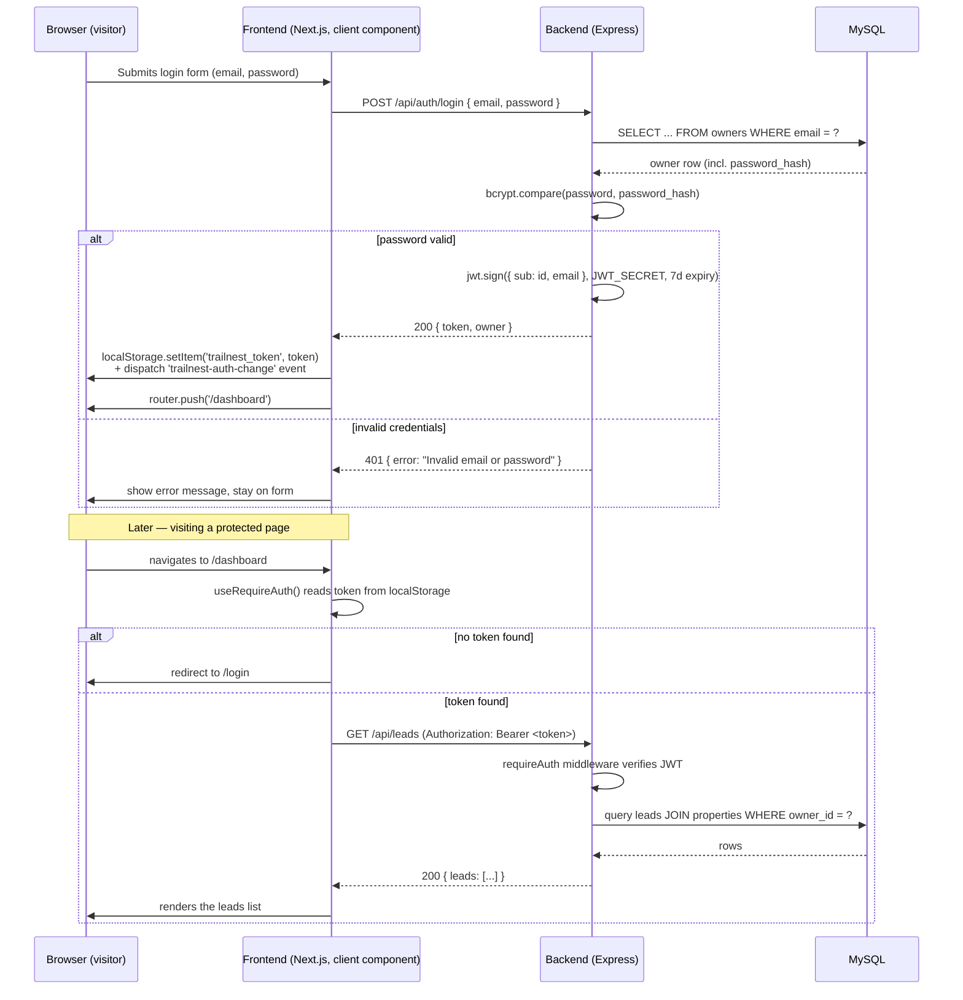

Key things worth internalizing here:

- **The password never leaves the backend in plain form on the way back out** — `bcryptjs`
  hashes it going in (`register`), and `bcrypt.compare` checks it going in again (`login`).
  The hash itself is one-way; TrailNest never needs to "decrypt" it.
- **The token is stateless.** The backend doesn't keep a session table — anyone holding a
  valid, unexpired JWT signed with the right `JWT_SECRET` is treated as authenticated. This is
  why `JWT_SECRET` must be a real secret in production, and why rotating it instantly logs
  everyone out.
- **The frontend stores the token in `localStorage`**, not a cookie — see
  `frontend/lib/auth.js`. That's a deliberate simplicity trade-off for a capstone project (no
  CSRF-token machinery needed since nothing is cookie-based), with the usual trade-off that
  `localStorage` is readable by any JS running on the page (XSS risk) — worth knowing as a
  limitation, not treating as invisible.
- The custom `trailnest-auth-change` browser event is how `SiteHeader` (which renders
  "Log in" vs "Dashboard / Log out") reacts instantly to a login/logout that happened in a
  totally different component, without any shared state library.

```
🖼️ PLACEHOLDER — screenshot of browser DevTools → Application → Local Storage,
   showing `trailnest_token` and `trailnest_owner` after logging in
   
```

---

## 8. The frontend (Next.js App Router)

### 8.1 Route map

Next.js's **App Router** turns the folder structure under `app/` directly into URL routes.
`(auth)` is a **route group** — parentheses mean "organize these routes together, but don't
add `/auth` to the actual URL."

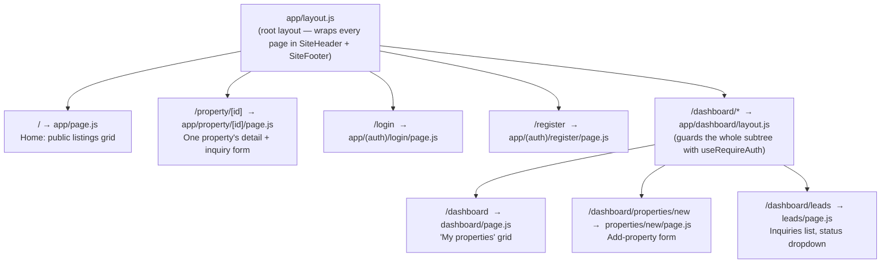

`[id]` is a **dynamic route segment** — `app/property/[id]/page.js` matches
`/property/1`, `/property/2`, etc., and the actual value is read via the `params` prop.

### 8.2 Server components vs. client components

This is the single biggest conceptual shift Next.js's App Router introduces versus older React
apps, and TrailNest uses both deliberately:

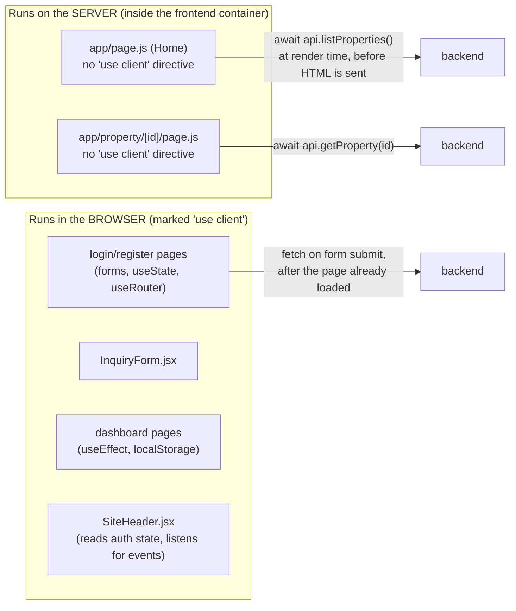

- **Server components** (the default — no `'use client'` at the top) run once, on the server,
  to produce HTML. `HomePage` and `PropertyDetailPage` are `async function` components that
  directly `await api.listProperties()` — no loading spinner needed, because by the time the
  browser receives the page, the data is already baked into the HTML.
- **Client components** (marked `'use client'` at the very top of the file) are the ones that
  need a browser: anything using `useState`, `useEffect`, `localStorage`, or an `onClick`
  handler. `InquiryForm`, the login/register pages, the whole `dashboard/` tree, and
  `SiteHeader` are all client components because they're either interactive forms or need to
  read `localStorage` (which doesn't exist on the server).

### 8.3 The trickiest idea in this whole project: two different API URLs

This is called out explicitly in `docs/DOCKER_GUIDE.md` as *the* thing to remember, and it's
worth its own diagram because it's the classic "works with `npm run dev`, breaks in Docker"
trap:

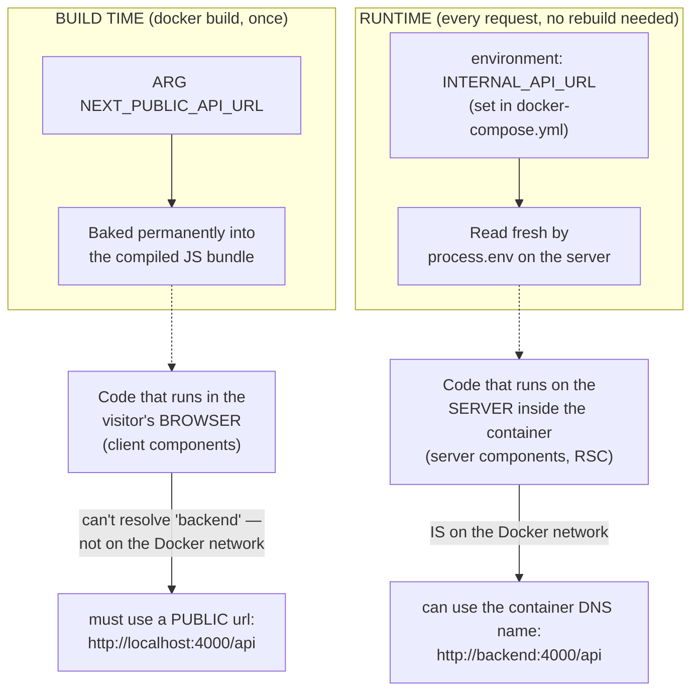

`frontend/lib/api.js` encodes this exact split in four lines:

```js
const API_URL =
  typeof window === 'undefined'
    ? process.env.INTERNAL_API_URL || process.env.NEXT_PUBLIC_API_URL || 'http://localhost:4000/api'
    : process.env.NEXT_PUBLIC_API_URL || 'http://localhost:4000/api';
```

`typeof window === 'undefined'` is `true` only when the code is executing on the server (no
`window` object exists there). Read it as: *"if I'm running on the server, prefer the internal
Docker-network address; if I'm running in the browser, I have no choice but to use the public
one."* Changing `NEXT_PUBLIC_API_URL` always requires rebuilding the frontend image — it's
frozen into the JavaScript the moment `npm run build` runs. Changing `INTERNAL_API_URL` never
does — it's read fresh every time a server component runs.

### 8.4 Component library tour

```
components/
├── ui/              Generic, app-agnostic primitives
│   ├── Button.jsx     variant (primary/secondary/ghost), size, fullWidth, polymorphic `as`
│   ├── Card.jsx       padded / interactive variants, also polymorphic `as`
│   └── Input.jsx       label + input/select/textarea in one component
├── property/        Domain-specific, property-related
│   ├── PropertyCard.jsx   used on both the public grid AND the owner dashboard grid
│   └── InquiryForm.jsx     the "ask about this stay" form on a property detail page
└── layout/          Wraps every page (from the root layout)
    ├── SiteHeader.jsx    logo, nav, login state–aware buttons
    └── SiteFooter.jsx
```

The `as: Tag = 'button'` / `as: Tag = 'div'` pattern in `Button` and `Card` is a small but
handy trick: it lets the exact same styled component render as a real `<button>` in most
places, but as a Next.js `<Link>` when it needs to navigate (see `PropertyCard`, which renders
a `Card` **as** a `Link` so the whole card is clickable).

```
🖼️ PLACEHOLDER — screenshot of the property detail page, showing the inquiry form
   

🖼️ PLACEHOLDER — screenshot of the owner dashboard's Leads page with the status dropdown
   
```

---

## 9. Docker & containerization

> `docs/DOCKER_GUIDE.md` (already in this repo) is the deep, line-by-line reference for this
> section — written by whoever built this project as they went, including the real bug they
> hit. This section is the concept-level summary with diagrams; go there for exact syntax.

### 9.1 The mental model

One container per independently-runnable piece, one shared network, one Compose file as the
single source of truth for how they fit together. (This is the same diagram as §4 — it's the
central idea of the whole project, so it's worth seeing twice.)

### 9.2 Multi-stage builds

A naive Dockerfile (`FROM node`, `COPY .`, `npm install`, done) ships your *entire*
`node_modules`, dev tooling, and build caches inside the final image. **Multi-stage builds**
use a disposable "fat" stage to build the app, then copy only the finished output into a thin
final stage — the fat stages never appear in the image you actually run.

**Backend** — two stages:

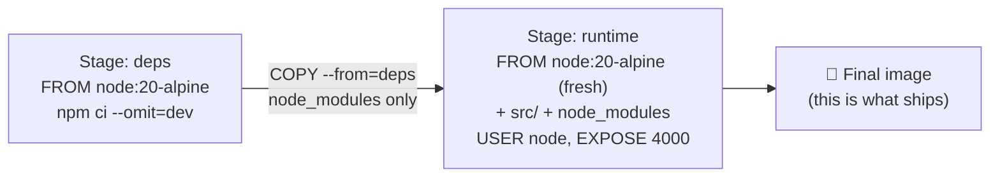

**Frontend** — three stages (Next.js needs an extra "build" step the backend doesn't):

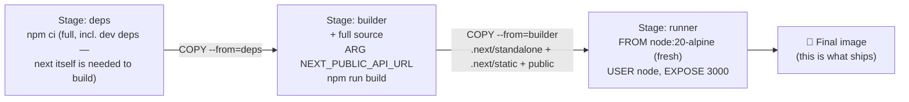

`output: 'standalone'` in `next.config.js` is what makes the tiny `runner` stage possible —
`next build` traces exactly which files are actually needed to run (not develop) the app and
copies only those into `.next/standalone`, so the final image never needs to run `npm install`
at all.

### 9.3 What every Dockerfile line is doing, condensed

| Line / pattern                                            | Why                                                                                     |
|-------------------------------------------------------------|-------------------------------------------------------------------------------------------|
| `FROM node:20-alpine`                                       | Alpine ≈ 40MB base vs. ~1GB for full `node:20`; `20` chosen because Next.js 16 requires `>=20.9.0` |
| `COPY package.json package-lock.json ./` before `COPY . .` | Docker caches each layer by its inputs — dependency install only re-runs when the lockfile changes, not on every source edit |
| `npm ci` (not `npm install`)                                | Installs exactly what's in the lockfile; fails loudly instead of silently rewriting it   |
| `USER node`                                                  | Runs the container as a non-root user — smaller blast radius if the app is ever compromised |
| `HEALTHCHECK ... CMD node -e "fetch(...)"`                  | Uses Node's built-in `fetch` instead of `curl`/`wget`, which Alpine doesn't ship by default |
| `CMD ["node", "src/server.js"]` (exec form, JSON array)     | Runs as PID 1 directly, so it receives `SIGTERM` correctly on `docker stop`               |
| `.dockerignore` (`node_modules`, `.env`, `.git`, `.next`)   | Keeps the build context small and stops secrets from ever being baked into an image layer |

### 9.4 `docker-compose.yml`, at a glance

| Service    | Image                | Host port | Waits on              | Notes                                                          |
|------------|------------------------|-----------|------------------------|-------------------------------------------------------------------|
| `db`       | `mysql:8.0` (official) | *(none)*  | —                        | Runs `db/schema.sql` + `db/seed.sql` automatically on first boot |
| `backend`  | built from `./backend` | `4000`    | `db` **healthy**        | `DB_HOST=db` — reaches MySQL by service name over the network    |
| `frontend` | built from `./frontend` | `3000`    | `backend` **healthy**   | Gets `NEXT_PUBLIC_API_URL` as a *build arg*, `INTERNAL_API_URL` as a *runtime env var* |

**Startup ordering**, visualized — this is what `depends_on: condition: service_healthy`
actually buys you over plain `depends_on`:

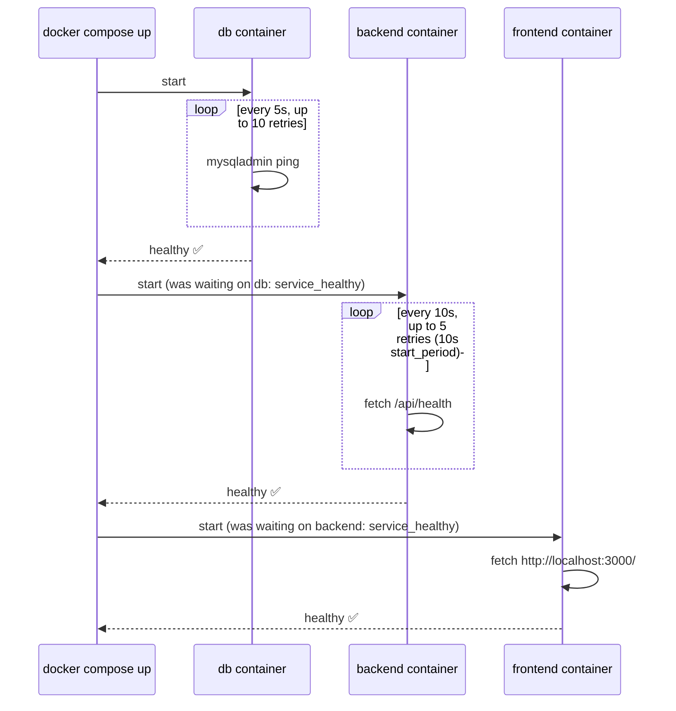

Plain `depends_on` (no condition) only waits for a container to *start* — not for the service
inside it to actually be ready to accept connections. MySQL takes a few seconds after starting
before it accepts connections, so without `service_healthy`, the backend would race MySQL and
crash-loop on its first few connection attempts.

### 9.5 Volumes & mounts

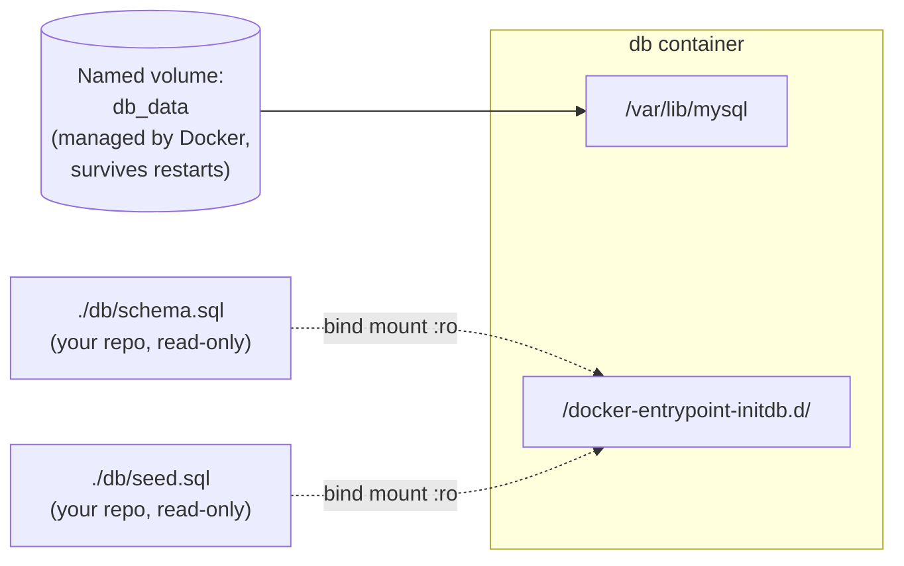

- **Named volume** (`db_data`) — Docker-managed storage for the actual MySQL data files.
  Without it, every `docker compose down` would wipe the entire database.
- **Bind mounts** (`./db/schema.sql:...:ro`) — a specific file from your repo, mounted
  read-only, so the container can read it but never write back into your source tree.

### 9.6 A real bug worth knowing about — the `HOSTNAME` gotcha

Docker automatically sets a `HOSTNAME` env var inside every container to that container's ID
(e.g. `427afc83926c`). Next.js's standalone `server.js` reads `process.env.HOSTNAME` and binds
to *that specific address* rather than to all network interfaces. Symptom: the app works fine
from the host (`curl localhost:3000` succeeds, because Docker's port-publishing proxy routes
straight to the container's network IP) — but the **in-container** healthcheck, which asks for
`http://localhost:3000/` *from inside the container*, gets `fetch failed`, because nothing is
actually listening on `127.0.0.1`. `docker compose ps` then reports the frontend as
`unhealthy` despite the app clearly running. Fix: `ENV HOSTNAME=0.0.0.0` in the frontend
Dockerfile, forcing the server to bind to all interfaces. Worth remembering for *any* future
Next.js-standalone + Docker project, not just this one.

```
🖼️ PLACEHOLDER — Docker Desktop (or `docker ps`) showing all three trailnest containers
   running, with their port mappings visible
   
```

---

## 10. Environment variables reference

### Root `.env` (read by Docker Compose, sits next to `docker-compose.yml`)

| Variable              | Required? | Purpose                                                                 |
|------------------------|-----------|---------------------------------------------------------------------------|
| `DB_ROOT_PASSWORD`     | Yes        | MySQL root password inside the `db` container                            |
| `DB_USER`               | No (default `trailnest`) | The app-level MySQL user the backend connects as                         |
| `DB_PASSWORD`           | Yes        | That user's password                                                     |
| `DB_NAME`                | No (default `trailnest_dev`) | Database name                                                            |
| `JWT_SECRET`             | Yes        | Signs/verifies auth tokens — must be long & random, never reused         |
| `CORS_ORIGIN`            | No (default `http://localhost:3000`) | Which origin the backend's CORS policy allows                            |
| `NEXT_PUBLIC_API_URL`    | No (default `http://localhost:4000/api`) | Public backend URL, **baked into the frontend at build time**            |

`${VAR:?message}` in `docker-compose.yml` means Compose refuses to start at all if that
variable is missing — a safety net against accidentally launching MySQL with a blank root
password. `${VAR:-default}` means "fine to fall back to a default."

### `backend/.env` (only used for the **non-Docker** local dev flow — `npm run dev`)

| Variable          | Local dev value (example)     | Notes                                             |
|---------------------|----------------------------------|------------------------------------------------------|
| `PORT`               | `4000`                            |                                                          |
| `DB_HOST`             | `localhost`                        | A locally-installed MySQL, not the Docker `db` service |
| `DB_USER` / `DB_PASSWORD` | your local MySQL credentials |                                                          |
| `JWT_SECRET`          | any long random string             | Local-only — never share with the Docker `.env` value |

### `frontend/.env.local` (only used for the **non-Docker** local dev flow)

| Variable                | Value                          |
|---------------------------|-----------------------------------|
| `NEXT_PUBLIC_API_URL`      | `http://localhost:4000/api`      |

All three `.env*` files (except the `.example` templates) are gitignored — they're never
committed, and Docker's `.dockerignore` files make sure they're never baked into an image
layer by accident either.

---

## 11. Running TrailNest

### Option A — local dev, no Docker (fastest inner loop while coding)

```bash
# one-time: create the database & load schema/seed
mysql -u root -p -e "CREATE DATABASE trailnest_dev"
mysql -u root -p trailnest_dev < db/schema.sql
mysql -u root -p trailnest_dev < db/seed.sql

# backend
cd backend
cp .env.example .env      # fill in local MySQL credentials
npm install
npm run dev                # http://localhost:4000

# frontend (separate terminal)
cd frontend
npm install
npm run dev                 # http://localhost:3000
```

### Option B — Docker Compose (the "real" containerized shape)

```bash
cp .env.example .env        # fill in DB_ROOT_PASSWORD, DB_PASSWORD, JWT_SECRET
docker compose up --build   # first run: builds images + starts everything
docker compose ps           # wait until all three show "healthy"
```

**Everyday commands while iterating:**

```bash
docker compose logs -f backend         # tail one service's logs
docker compose up -d --build frontend  # rebuild + restart just one service after a code change
                                        # (Compose does NOT auto-rebuild on file save)
docker exec -it trailnest-backend-1 sh # shell into a running container
docker compose down                     # stop everything (db data volume kept)
docker compose down -v                  # also wipe db_data — next `up` starts fully fresh
```

### Verifying it's actually working (not just "green")

```bash
curl http://localhost:4000/api/health       # {"status":"ok","db":"connected"}
curl http://localhost:4000/api/properties   # real seeded data, through the backend container
curl http://localhost:3000/                 # a 200 here only proves the frontend is up —
                                             # check that the returned HTML actually contains
                                             # property names, which proves the frontend
                                             # successfully reached the backend over the
                                             # Docker network, not just that both are running
```

```
🖼️ PLACEHOLDER — terminal screenshot of the three `curl` checks above, output visible
   
```

---

## 12. Screenshots & visuals

A consolidated checklist of every placeholder in this document — capture these as you go and
drop them into `docs/images/`:

- [ ] Home page — public listings grid
- [ ] Property detail page — with the inquiry form
- [ ] Login page
- [ ] Register page
- [ ] Owner dashboard — "My properties"
- [ ] Owner dashboard — "Add a property" form
- [ ] Owner dashboard — Leads list with status dropdown
- [ ] Browser DevTools → Local Storage, showing the session token after login
- [ ] `docker compose ps` — all three services healthy
- [ ] Docker Desktop (or `docker ps`) — containers + port mappings
- [ ] A DB GUI tool connected to the containerized MySQL, showing the three tables
- [ ] Terminal — the three `curl` verification checks from §11

---

## 13. Glossary — plain-language terms

| Term | In one sentence |
|------|--------------------|
| **Image** | A frozen, read-only snapshot of a filesystem + startup command — the "recipe," built once. |
| **Container** | A running instance of an image — the "dish" made from the recipe; you can run many containers from one image. |
| **Multi-stage build** | A Dockerfile with several `FROM` lines, where later stages selectively copy files out of earlier ones, discarding the rest — used to keep final images small. |
| **Layer / layer caching** | Each Dockerfile instruction produces a cached layer; if its inputs haven't changed, Docker reuses the cache instead of re-running it — the reason `COPY package.json` comes before `COPY .`. |
| **Bridge network** | A private virtual network Docker creates so containers can find and talk to each other by name. |
| **Named volume** | Docker-managed persistent storage that survives container restarts/recreations (used here for MySQL's data files). |
| **Bind mount** | Mounting a specific file/folder from your machine directly into a container (used here for `schema.sql`/`seed.sql`). |
| **Healthcheck** | A command Docker runs periodically *inside* a container to decide if it's actually ready to serve traffic, not just "started." |
| **`depends_on: condition: service_healthy`** | Tells Compose to wait for another service's healthcheck to pass, not just for its container to start. |
| **Build-time vs. runtime env var** | A build-time var (like `NEXT_PUBLIC_API_URL`) is frozen into the app when it's compiled; a runtime var (like `INTERNAL_API_URL`) is read fresh every time the app runs — changing the first needs a rebuild, the second doesn't. |
| **Server component vs. client component** | A server component renders once on the server into HTML; a client component ships JS to the browser and can use state, effects, and browser-only APIs like `localStorage`. |
| **JWT (JSON Web Token)** | A signed, tamper-evident token proving "this user logged in successfully" — the server can verify it without keeping a database record of active sessions. |
| **Connection pool** | A small set of reusable, already-open database connections, handed out per query instead of opening a fresh one every time. |
| **Reverse proxy** | (Not used yet in this project — will matter at EC2 deploy time) A server that sits in front of your app and forwards incoming traffic to it, usually adding HTTPS along the way. |

---

## 14. What's next

Per the README, AWS EC2 deployment is the next phase, once this Docker Compose setup is fully
verified locally: provisioning an Ubuntu instance, configuring security groups (SSH from your
IP only, HTTP/HTTPS public), installing Docker + the Compose plugin, and running this exact
same `docker-compose.yml` there — with real production secrets swapped in for the local dev
ones.

```
🖼️ PLACEHOLDER — once deployed, a screenshot of the live site running on the EC2 public IP/domain
   
```
